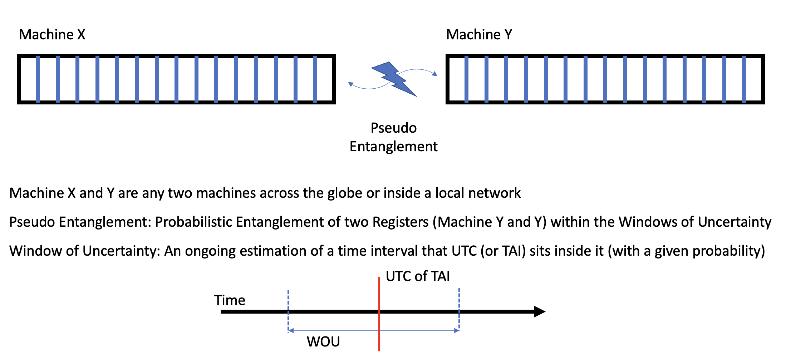

# Tangle: Chronological Association of Event Logging

## Problem Statement

Often debugging in distributed systems requires finding the chronological
association between events across multiple machines (connected via the
network). Chronological association allows us to single out the original
causing event and remediate from it. In the absence of a global clock,
associating events in different machines can be challenging. This is mainly
because events in machines are timestamped using a local clock built in each
individual machine.

To associate the events, timestamped by the clocks of each machine, it is
necessary to have the clocks synchronized to a required level of precision and
accuracy. Assuming all the machines are connected via a network, there are
various methods to synchronize the clocks. These methods provide different
levels of precision in clock synchronization.

Methods based on hardware and network appliances capabilities tend to provide
higher precision, resulting in lower clock skewness. Clock skewness determines
the window of uncertainty, which is a statistical indication of the minimum
time range that can be used to associate an event with events in other
machines.

## Diagram 1: Event Association Across Different Machines

The first DOCX diagram is composed of Word drawing objects (text boxes,
connectors, and shapes). The extracted labels are preserved below, and the
layout is represented with the following reconstructed diagram:

## Background

Using the open time server with the Time Card alongside the precision time
protocol (PTP) in the network and precision time measurement (PTM) in the
machines across the distributed system, the time uncertainty across the CPUs
of each machine can be brought down to the range of two-digit nanoseconds.
This level of precision allows the granularity of association of event to be
enough to single out events. In other words, the chronological order of a
given event in one machine can be associated across any other machine.

There are different types of clocks in Linux which are meant to serve
different purposes and are used by the operating system and applications in
different ways. For simplicity, here we will focus on two of them:
`CLOCK_BOOTTIME` based on CPU's ART (Always Running Timer) and
`CLOCK_REALTIME` which is a projection of ART with a correction. Before the
machine turns on, there is a hardware clock called RTC (Real Time Clock) which
is powered with a battery to keep the time within seconds (if synchronized
previously without power interruption).

Upon turning on the system, `CLOCK_BOOTTIME` and `CLOCK_REALTIME` are
initiated. `CLOCK_BOOTTIME` starts with the value zero while `CLOCK_REALTIME`
uses the value of the RTC clock upon initiation (only once at the initiation).
`CLOCK_BOOTTIME` remains as read only register to provide a monotonic time
while `CLOCK_REALTIME` can be adjusted by any synchronization method if
necessary. This means that `CLOCK_REAMTIME` can move backward or change in pace
during synchronization events.

The operating system uses the `CLOCK_BOOTTIME` for event logging to avoid
duplication of timestamps of events caused by synchronization.

## Using CLOCK_BOOTTIME

System logs (`dmesg`) are timestamped based on uptime (`CLOCK_BOOTTIME`) rather
than universal time coordination (UTC, like `CLOCK_REALTIME`). Therefore, it is
necessary to convert the machine's uptime to UTC to be able to do the
chronological association. In addition, it is necessary to estimate the window
of uncertainty to determine the level of granularity of chronological event
association.

The concept of pseudo entanglement is a byproduct of keeping the
synchronization between the clocks across the network, with a statistical
assurance, within a calculated error.

## Diagram 2: Pseudo Entanglement and WOU

This is the embedded image extracted from the DOCX package:

Text visible inside the diagram image:

- `Machine X`
- `Machine Y`
- `Pseudo Entanglement`
- `Machine X and Y are any two machines across the globe or inside a local network`
- `Pseudo Entanglement: Probabilistic Entanglement of two Registers (Machine Y and Y) within the Windows of Uncertainty`
- `Window of Uncertainty: An ongoing estimation of a time interval that UTC (or TAI) sits inside it (with a given probability)`
- Timeline labels: `Time`, `UTC of TAI`, `WOU`

## Method

Associated logging is a tool built on top of distributed precise time
synchronization across the fleet. It allows the association of logs taken in
different machines based on their local time using the precision time protocol
(PTP) and precision time measurement (PTM). In addition to the distributed
time, each node calculates the window of uncertainty. Window of uncertainty is
a statistical measure of precision. If the precision is higher (tighter) than
the logging frequency, the logging will be considered entangled.

